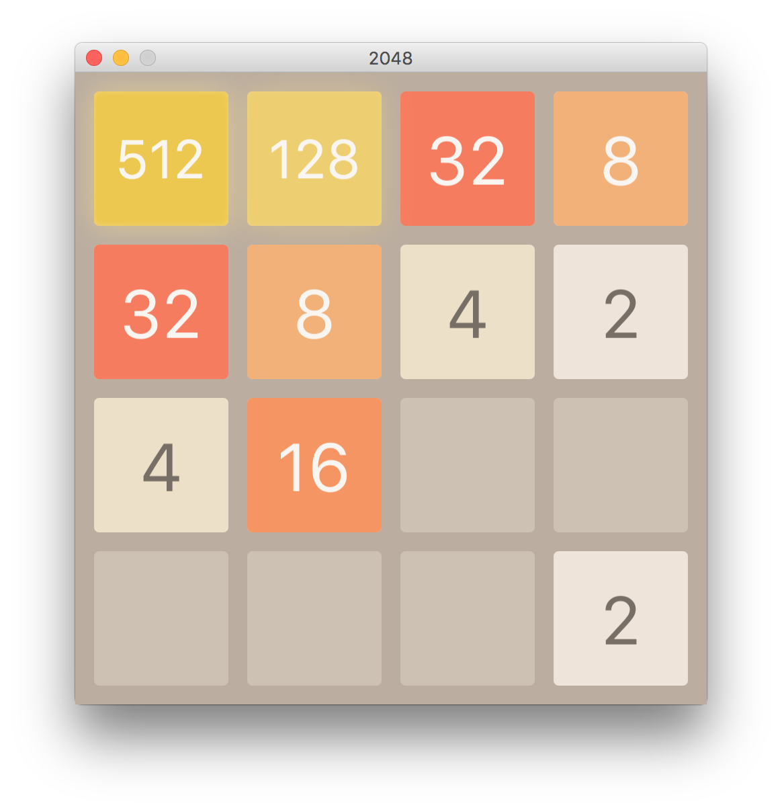

# 2048 in JavaFx

Re-implementation of the famous 2048 game in Java 8 using JavaFx.

## Building

    $ javac -d bin -sourcepath src src/org/degutis/game2048/Main.java

## Running

    java -cp bin org.degutis.game2048.Main

## Screenshot

